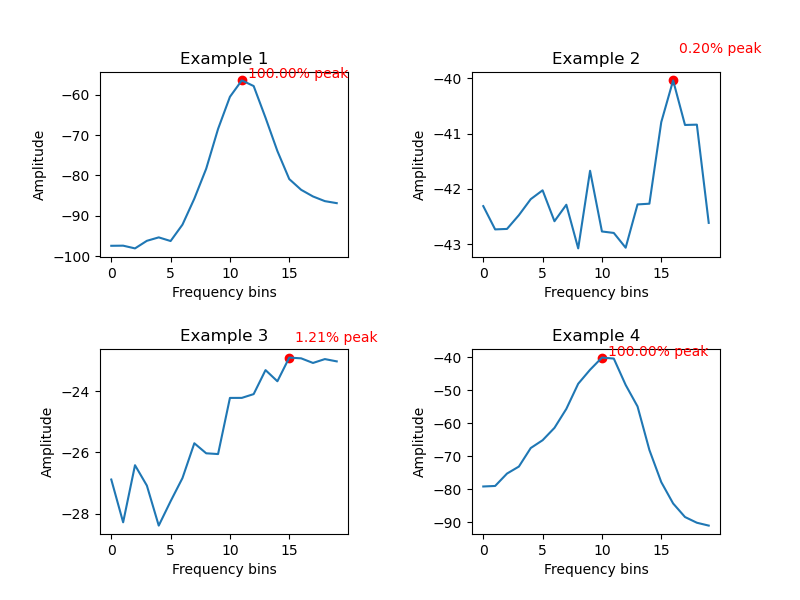
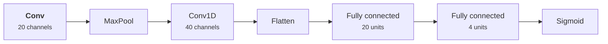
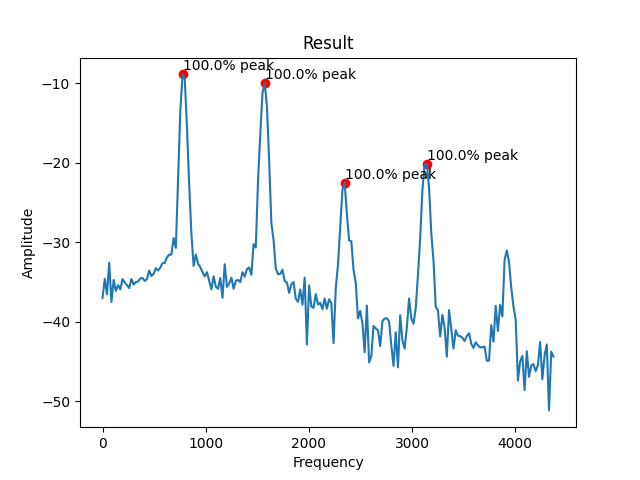

# Everest
Peaks identification using CNN

<p align="center"></p>

## Model 



## Setup
Clone the Repository.
```bash
git clone https://github.com/enter-opy/everest.git
cd everest
```

## Usage

```python
from everest import find_peaks

peaks_loc, peaks_mag, probs = find_peaks(X, threshold=0.5)
```

### Parameters
- `X` (_array-like_): Input array representing the signal.
- `threshold` (_float_): Probability threshold for identifying peaks.

### Returns
- `peaks_loc` (_numpy.array_): Locations of the peaks.
- `peaks_mag` (_numpy.array_): Values of the peaks.
- `probs` (_numpy.array_): Probabilities associated with each peak.

## Results

<p align="center"></p>

## Contributing
Contributions to Everest are welcome! If you'd like to contribute, follow these steps:
1. **Fork the Repository:** Start by forking the [Everest](https://github.com/enter-opy/everest).
2. **Make Changes:** Create a new branch , make your changes, and commit them to your branch.
3. **Create a Pull Request:** Push your changes to your fork and submit a pull request to the original repository.
## License
This project is licensed under the GNU General Public License. See the [LICENSE](https://github.com/enter-opy/everest/blob/main/LICENSE) for details.

### References

- Anne Bech Risum, Rasmus Bro, [Using deep learning to evaluate peaks in chromatographic data](https://www.researchgate.net/publication/333266782_Using_deep_learning_to_evaluate_peaks_in_chromatographic_data), 2019
- Arsenty D. Melnikov, Yuri P. Tsentalovich, Vadim V. Yanshole, [Deep Learning for the Precise Peak Detection in High-Resolution LC-MS Data](https://pubs.acs.org/doi/10.1021/acs.analchem.9b04811), 2019